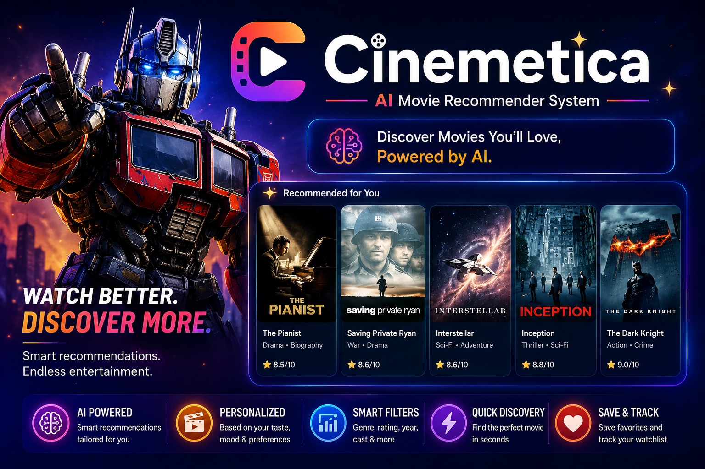

<h1>
  
  Cinemetica
</h1>

  

  A Streamlit-based movie recommendation system that suggests similar movies based on content-based filtering and cosine similarity.

  

  

<h2>📌 About the Project</h2>

  The Movie Recommender System suggests movies based on similarity in genres, keywords, cast, and overview.
  It uses content-based filtering to find movies that closely match the selected title.

  Built using machine learning techniques like TF-IDF vectorization and cosine similarity,
  the system efficiently recommends movies in real time through a simple Streamlit interface.

<h2>⚙️ Built With</h2>

  
  
  
  
  

<h2>✨ Features</h2>

<table width="100%">
  <tr>
    <th align="left">Feature</th>
    <th align="left">Description</th>
  </tr>

  <tr>
    <td>Content-Based Recommendation</td>
    <td>Suggests movies based on similarity in genres, keywords, cast, and overview.</td>
  </tr>

  <tr>
    <td>TF-IDF Vectorization</td>
    <td>Converts movie metadata into numerical feature vectors for similarity computation.</td>
  </tr>

  <tr>
    <td>Cosine Similarity</td>
    <td>Measures similarity between movies to generate accurate recommendations.</td>
  </tr>

  <tr>
    <td>Fast Recommendation Engine</td>
    <td>Uses precomputed similarity matrix for instant results.</td>
  </tr>

  <tr>
    <td>Optimized Model Loading</td>
    <td>Loads preprocessed .pkl files for efficient performance.</td>
  </tr>

  <tr>
    <td>Streamlit Interface</td>
    <td>Provides a simple and interactive web UI for user input and results.</td>
  </tr>
</table>

<h2>⚡ How It Works</h2>

  The system analyzes movie metadata and compares similarity between movies using cosine similarity.

<ol>
  <li>Load dataset (TMDB 5000 movies)</li>
  <li>Combine features like genres, cast, keywords, and overview</li>
  <li>Convert text data into numerical vectors using TF-IDF</li>
  <li>Compute cosine similarity between all movies</li>
  <li>Recommend top similar movies based on user input</li>
</ol>

<h2>📬 Connect With Me</h2>

  

  

  

  

 

  Thanks for checking out the Movie Recommender System.  
  Feedback and suggestions are always welcome.

